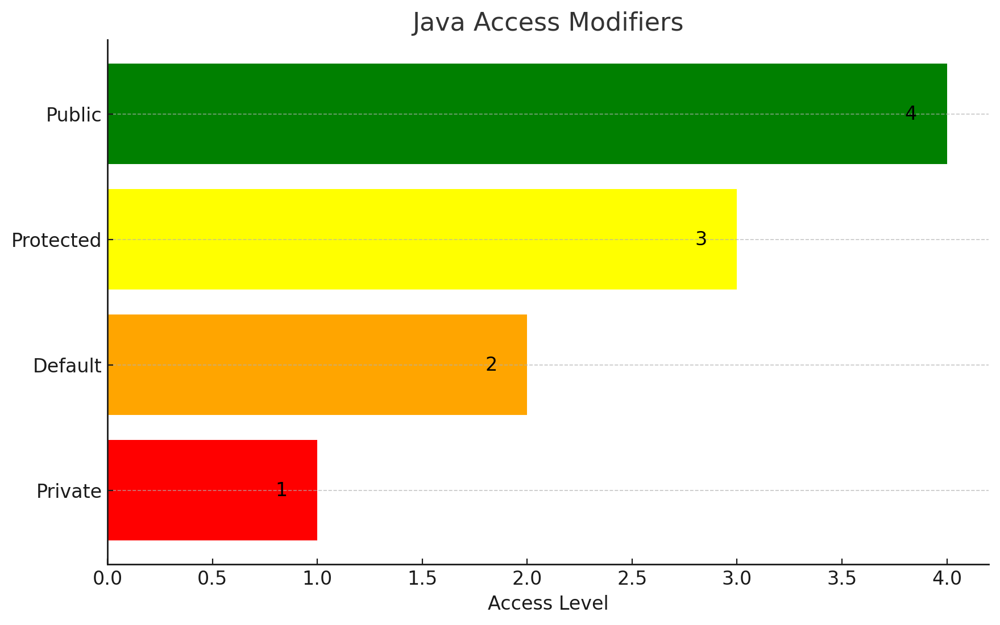

# Модификаторы доступа в Java: Всё, что вам нужно знать

## Введение

Привет, дорогие читатели! В этой статье мы погрузимся в мир модификаторов доступа в Java. Это ключевые слова, с которыми вы, вероятно, уже сталкивались, но возможно, не до конца понимаете их суть. Научиться правильно использовать модификаторы доступа - значит сделать ваш код более безопасным и поддерживаемым.

## Что такое модификаторы доступа?

Модификаторы доступа в Java используются для установки уровня доступа к классам, полям, методам и конструкторам. Они определяют, из каких других классов можно получить доступ к определенному члену класса.

## Типы модификаторов доступа

Вот диаграмма, иллюстрирующая различные уровни модификаторов доступа в Java:

- **Public**: Доступ разрешен отовсюду (уровень 4, зелёный).
- **Protected**: Доступ разрешен внутри пакета и во всех подклассах (уровень 3, жёлтый).
- **Default**: Доступ разрешен внутри пакета (уровень 2, оранжевый).
- **Private**: Доступ разрешен только внутри того класса, где объявлен член (уровень 1, красный).



## Применение модификаторов доступа

### В классах

```java
public class Computer {
    // Код класса
}
```

Здесь `public` означает, что класс `Computer` доступен из любого другого класса.

### В полях

```java
public class Computer {
    private int ssd;
    public int ram;
}
```

Здесь поле `ssd` доступно только внутри класса `Computer`, а поле `ram` доступно отовсюду.

### В методах и конструкторах

```java
public class Computer {
    public Computer() {
        // Конструктор
    }

    private void load() {
        // Приватный метод
    }
}
```

## Лучшие практики

1. **Инкапсуляция**: Старайтесь делать поля класса приватными и предоставлять к ним доступ через публичные методы.
2. **Минимальный уровень доступа**: Всегда выбирайте наименьший необходимый уровень доступа.

## Заключение

Модификаторы доступа - это не просто "ключевые слова", это мощный инструмент для управления доступом и инкапсуляции кода. Правильное их использование повышает безопасность и поддерживаемость вашего кода.

Спасибо за внимание! Приятного кодинга!
